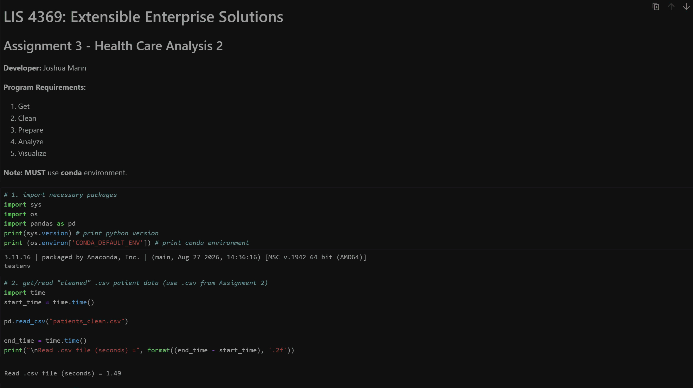

# LIS 4369: Extensible Enterprise Solutions

## Joshua Mann

### Assignment 3 Requirements:
1. Backward-engineer (using Python) the A2 video
2. Utilize cleaned file from past assignment for analysis
3. Ensure Python test environment is used for programming packages
4. 3 skillsets with screenshots and file locations

### README.md file should include the following items:

* Gif of A3 program
* Link to a3.ipynb file
* 3 skillsets with links to functions, home directory, and images/gifs of running programs

### Assignment Screenshots/Gifs:

#### *A3 Reverse-Engineered Program:* [a3.ipynb](a3.ipynb)

### Assignment Skillsets: [Skillsets Home Directory](https://github.com/jm23p/lis4369/tree/main/skillsets)

#### *Skillset 4: Calorie Percentage:* [SS4 Functions](https://github.com/jm23p/lis4369/blob/main/skillsets/ss4_calorie_percentage/functions.py)

#### *Skillset 5: Python Selection Structures:* [SS5 Functions](https://github.com/jm23p/lis4369/blob/main/skillsets/ss5_python_selection_structures/functions.py)

#### *Skillset 6: Python Loops:* [SS6 Functions](https://github.com/jm23p/lis4369/blob/main/skillsets/ss6_python_loops/functions.py)
